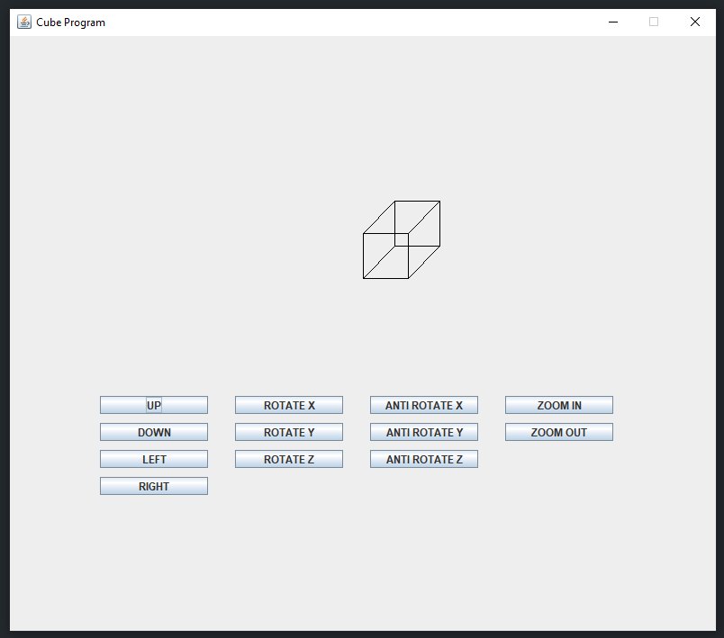

# Java Cube Project

## Getting Started

This program will display a cute 3D cube in a Java Window

## Folder Structure

The workspace contains two folders, where:

- `src`: the folder to maintain sources
- `lib`: the folder to maintain dependencies
- `img`: the folder to storage images of functionality

## Preview

